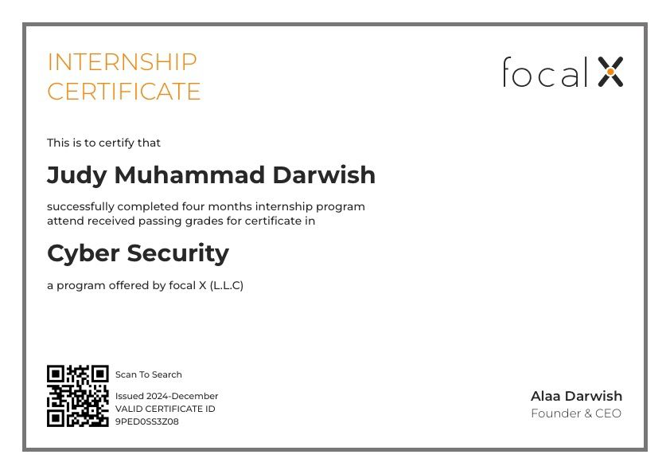

# Judy Darwish — Cyber Security Trainee | Penetration Tester 

Welcome to my cybersecurity portfolio.  
This repository showcases all my hands‑on work from my cybersecurity training, including penetration testing projects , TryHackMe progress, theoretical and practical tasks, and real application exploitation.

I trained as a **Cyber Security / Penetration Tester** and I am also interested in the **Jr Penetration Tester path**, currently progressing through TryHackMe rooms and completing hands‑on labs.

---

# Training Summary
- Trained at a Focal x company as a **Penetration Tester**
- Completed **10+ theoretical and practical tasks**
- Performed multiple hands‑on labs (VMs, Burp, TryHackMe)
- Completed theoretical exams + practical tests
- Finished **2 graduation projects**  
- Earned several TryHackMe **badges**
- completed **Pre-security** path
- Enrolled with **Jr-Penetration-Tester** Path 
---

# Certificates

###  Focal X Cybersecurity Certificate

# Main Cybersecurity Projects

## **cyberX – Vulnerable System Penetration Test**
A full attack chain on a vulnerable machine during my training program.

**What I did:**
- Scanned ports and services  
- Enumerated the attack surface  
- Identified exploitable vulnerabilities  
- Performed exploitation  
- Privilege escalation to full system control  

📁 : [`projects/cyberX`](./projects/cyberX)

## **Juice Shop OWASP Top 10 (Docker Deployment)**
A full web‑application pentest based on OWASP Top 10.

**Setup:**
- Installed Docker on VMware  
- Pulled & deployed Juice Shop  
- Tested vulnerabilities manually and with Burp Suite

**Vulnerabilities tested:**
- SQL Injection  
- XSS  
- IDOR  
- Authentication Bypass  
- Security Misconfiguration  
- Sensitive Data Exposure  

**Score achieved:** **97/100**

📁 : [`projects/Juice-shopOWASPTOP10`](./projects/Juice-shopOWASPTOP10)

##  Skills Gained

###  Penetration Testing Skills (Focal X Training)
- Port scanning & service enumeration (Nmap, Gobuster)
- Attack surface mapping & reconnaissance
- Vulnerability identification & analysis
- Manual exploitation fundamentals
- Authentication bypass techniques (current progress in Jr Penetration Tester path)
- Burp Suite basics (Proxy, Repeater, Intruder)
- Web application testing (OWASP Top 10)
- Privilege escalation concepts
- Docker deployment for security labs (Juice Shop)
- Documenting findings & writing technical reports
- Hands‑on testing on vulnerable machines (CyberX project)

---
## TryHackMe Progress — Hands‑On Labs

This page highlights the practical rooms I completed on TryHackMe as part of my cybersecurity training.  
During my internship at a private cyber security training company, I was required to complete specific hands‑on labs on TryHackMe.  
I am continuing to study regularly and progressing through more Pre-security and Jr Penetration Tester paths.

###  Pre‑Security Path Skills (TryHackMe)
- Networking fundamentals (TCP/IP, ports, protocols)
- Linux command‑line basics
- Web fundamentals (HTTP, requests, responses)
- Cybersecurity foundations & core concepts
- Basic cryptography understanding
- Identifying common vulnerabilities (SQLi, XSS, IDOR basics)
- Understanding how websites and servers work

###  Jr Penetration Tester Path (Current Progress)
The following rooms from the **Jr Penetration Tester Path** have been completed:
- **Introduction to Cyber Security**
- **Introduction to Pentesting**
- **Introduction to Web Hacking**

##  Completed Rooms & Badges

All completed TryHackMe rooms and earned badges are documented with screenshots inside this folder :

📁 : [`projects/tryhackme/screenshot`](./projects/tryhackme/screenshot).  

This section will be updated as I complete new rooms and advance through more cybersecurity learning paths.
---

###  Tools 
- Burp Suite  
- Nmap  
- Gobuster
- curl
- Metasploit Framework  
- Kali Linux  
- Linux Terminal  
- VMware Workstation   
- Wireshark  
- Docker (Juice Shop deployment)  
- SQL / MariaDB  
- HTTP Request & Response Analysis  
- OWASP Top 10 Basics

---
# Focal X Assignments (10+ Tasks)
During training, I completed over **10 theoretical and practical assignments** covering:

- Networks  
- Encryption  
- Web security  
- Enumeration  
- Linux basics  
- Windows basics  
- Traffic analysis  
- TryHackMe labs  
- Theory + practical exams  

Practical tasks will be added soon to the assignments folder.

📁 Folder: `assignments/`

---
##  Technologies

- Linux Operating System  
- Windows Operating System (VM)  
- Virtualization (VMware Workstation)  
- Docker (running vulnerable labs as Juice Shop)  
- Web Technologies (HTTP, HTTPS, Cookies, Sessions)  
- Databases (SQL, MariaDB)  
- Networking Fundamentals (TCP/IP, Ports, Protocols)  
- Web Application Security Concepts (OWASP Top 10)  
- Authentication & Authorization Concepts  
- Client–Server Architecture  

---

# Contact
**GitHub:** [github.com/judydarwish](https://github.com/judydarwish)  
**Email:** [judydarwish3@gmail.com](mailto:judydarwish3@gmail.com)  
**LinkedIn:** [linkedin.com/in/judymdarwish](https://www.linkedin.com/in/judymdarwish/)

Thanks for viewing my portfolio!
